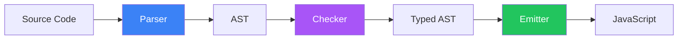

# パイプ演算子をTypeScript<br>に勝手に実装して遊ぶ話

中村崇人

<div class="abs-br m-6 flex gap-2">
  <a href="https://github.com/aTakatoNakamura" target="_blank" alt="GitHub" title="Open in GitHub"
    class="text-xl slidev-icon-btn opacity-50 !border-none !hover:text-white">
    <carbon-logo-github />
  </a>
</div>

<!--
こんにちは！今日はTypeScriptコンパイラにパイプ演算子を実装した話をします。
-->

---
transition: fade-out
---

# パイプ演算子とは？

JavaScript/TypeScriptの提案中の構文

<div class="grid grid-cols-2 gap-8 mt-8">

<div>

### 従来の書き方 😰

```ts
console.log(
  double(
    square(
      add(1, 2)
    )
  )
);
```

ネストが深くて読みづらい...

</div>

<div v-click>

### パイプ演算子 ✨

```ts
1
  |> add(%, 2)
  |> square(%)
  |> double(%)
  |> console.log(%);
```

左から右へ、処理の流れが明確！

</div>

</div>

<div v-click class="mt-8 text-sm opacity-75">

💡 Stage 2の提案: https://github.com/tc39/proposal-pipeline-operator

</div>

<!--
パイプ演算子は、関数の結果を次の関数に渡していく構文です。
左から右へ処理の流れが読めるので、とても読みやすくなります。
-->

---
transition: slide-up
---

# 今回実装したバージョン

シンプルな `|>` 演算子

```ts
function double(x: number): number {
  return x * 2;
}

function square(x: number): number {
  return x * x;
}

// シンプルなパイプ
const result1 = 5 |> double;  // → (double)(5)

// チェーン可能
const result2 = 5 |> square |> double;  // → (double)((square)(5))
```

<div v-click class="mt-6 p-4 bg-orange-500 bg-opacity-10 rounded">

⚠️ 実験的実装：Hack Proposal版ではなく、最もシンプルな形で実装

</div>

<!--
今回は、最もシンプルなパイプ演算子を実装しました。
左の値を右の関数に渡すだけの単純な形です。
-->

---
layout: center
---

# TypeScriptコンパイラの3層構造

<div class="grid grid-cols-3 gap-4 mt-12">

<div v-click class="p-6 bg-blue-500 bg-opacity-10 rounded">

### 1️⃣ Parser

**入力**: ソースコード  
**出力**: AST

トークン分割 → 構文解析

<div class="text-xs mt-4 opacity-75">
scanner.ts, parser.ts
</div>

</div>

<div v-click class="p-6 bg-purple-500 bg-opacity-10 rounded">

### 2️⃣ Checker

**入力**: AST  
**出力**: 型情報付きAST

型推論・型チェック

<div class="text-xs mt-4 opacity-75">
checker.ts
</div>

</div>

<div v-click class="p-6 bg-green-500 bg-opacity-10 rounded">

### 3️⃣ Emitter

**入力**: AST  
**出力**: JavaScript

コード生成

<div class="text-xs mt-4 opacity-75">
emitter.ts
</div>

</div>

</div>

<div v-click class="mt-8 text-center">



</div>

<!--
TypeScriptコンパイラは3層のアーキテクチャで構成されています。
それぞれが明確な責務を持っていて、パイプ演算子の実装では全ての層を修正する必要がありました。
-->

---
---

# AST（抽象構文木）の構造

PipeExpressionのノード表現

<div class="grid grid-cols-2 gap-8 mt-8">

<div>

### コード

```ts
const result = 5 |> square |> double;
```

<div v-click class="mt-6">

### 期待する出力

```js
var result = (double)((square)(5));
```

</div>

</div>

<div v-click>

### AST構造

```
PipeExpression
├─ left: PipeExpression
│  ├─ left: NumericLiteral (5)
│  ├─ operator: |>
│  └─ right: Identifier (square)
├─ operator: |>
└─ right: Identifier (double)
```

<div class="mt-4 p-3 bg-yellow-500 bg-opacity-10 rounded text-sm">

💡 左結合で再帰的な構造になる！

</div>

</div>

</div>

<!--
パイプ演算子は左結合なので、ASTは左側に深くネストする構造になります。
この再帰的な構造を正しく処理することが、実装のポイントでした。
-->

---
---

# ステップ1: パーサー

新しいトークンとASTノードの追加

````md magic-move {lines: true}
```ts
// types.ts - SyntaxKindに追加
export const enum SyntaxKind {
    // ...
    BarGreaterThanToken,  // |>
    // ...
    PipeExpression,       // パイプ式のAST
}
```

```ts
// scanner.ts - トークン認識
function scan(): SyntaxKind {
    // ...
    case CharacterCodes.bar:
        if (text.charCodeAt(pos + 1) === CharacterCodes.greaterThan) {
            return pos += 2, token = SyntaxKind.BarGreaterThanToken;
        }
    // ...
}
```

```ts
// parser.ts - AST構築
function parseBinaryExpressionOrHigher() {
    // ...
    case SyntaxKind.BarGreaterThanToken:
        return factory.createPipeExpression(
            leftOperand,
            operatorToken,
            rightOperand
        );
}
```
````

<!--
まずパーサーで、|>トークンを認識し、PipeExpressionというASTノードを作成します。
-->

---
---

# ステップ2: チェッカー

型チェックロジックの追加

```ts {1-3|5-6|8-9|11-15|all}
// checker.ts
function checkPipeExpression(node: PipeExpression): Type {
    // 左辺の型をチェック
    const leftType = checkExpression(node.left);
    
    // 右辺（関数）の型をチェック  
    const rightType = checkExpression(node.right);
    
    // TODO: 関数が左辺の型を受け取れるか検証
    // TODO: 戻り値の型を返す
    
    // 今回はシンプルに右辺の型を返す
    return rightType;
}
```

<div v-click class="mt-4 p-3 bg-blue-500 bg-opacity-10 rounded text-sm">

💡 本格実装なら、関数のシグネチャと引数の型の互換性チェックが必要

</div>

<!--
チェッカーでは型の検証を行います。今回はシンプルな実装なので、詳細な型チェックは省略しました。
-->

---
---

# ステップ2: チェッカー

型システムとの統合

````md magic-move {lines: true}
```ts
// checker.ts - 型チェックの基本
function checkPipeExpression(node: PipeExpression): Type {
    // 左辺（引数）の型を取得
    const leftType = checkExpression(node.left);
    
    // 右辺（関数）の型を取得
    const rightType = checkExpression(node.right);
    
    return rightType;
}
```

```ts
// 本格的には...
function checkPipeExpression(node: PipeExpression): Type {
    const leftType = checkExpression(node.left);
    const rightType = checkExpression(node.right);
    
    // 関数の型を取得
    const signatures = getSignaturesOfType(rightType, SignatureKind.Call);
    
    // 引数の型が一致するかチェック
    if (!isTypeAssignableTo(leftType, getTypeOfFirstParameter(signature))) {
        error(node, "型の不一致");
    }
    
    // 戻り値の型を返す
    return getReturnTypeOfSignature(signature);
}
```

```ts
// 型の流れ
5 |> square |> double

// leftType: number (5)
// rightType: (x: number) => number (square)
// ↓
// leftType: number (square(5)の結果)  
// rightType: (x: number) => number (double)
// ↓
// 最終的な型: number
```
````

<!--
チェッカーでは型の検証を行います。
左辺の型が右辺の関数の引数として渡せるかチェックし、関数の戻り値の型を次に伝播させます。
-->

---
---

# ステップ3: エミッター（重要）

再帰的なコード生成

```ts {all|4-8|10-15|all}
// emitter.ts
function emitPipeExpression(node: PipeExpression) {
    // a |> b を (b)(a) に変換
    write("(");
    emit(node.right);  // 関数
    write(")(");
    
    // ⚠️ ここが重要！左辺がPipeExpressionなら再帰
    if (node.left.kind === SyntaxKind.PipeExpression) {
        emitPipeExpression(node.left as PipeExpression);  // 再帰呼び出し
    } else {
        emit(node.left);  // 通常の値
    }
    
    write(")");
}
```

<div class="mt-4 grid grid-cols-2 gap-4 text-sm">

<div v-click class="p-3 bg-blue-500 bg-opacity-10 rounded">

**入力**: `5 |> square |> double`

**AST**: 右のPipeExpressionから処理

</div>

<div v-click class="p-3 bg-green-500 bg-opacity-10 rounded">

**出力**: `(double)((square)(5))`

**順序**: 外側→内側へ再帰

</div>

</div>

<!--
エミッターでは、ASTを辿りながらJavaScriptコードを生成します。
再帰的な構造を正しく処理するため、明示的な再帰呼び出しが必要でした。
-->

---
---

# デモ 🎬

実際に動かしてみよう！

```ts
function double(x: number): number {
    return x * 2;
}

function square(x: number): number {
    return x * x;
}

const result1 = 5 |> double;
console.log("result1:", result1);  // 10

const result2 = 5 |> square |> double;
console.log("result2:", result2);  // 50
```

<div class="mt-6 p-4 bg-gradient-to-r from-blue-500 to-purple-500 bg-opacity-20 rounded">

```bash
$ node built/local/tsc.js test.ts
$ node test.js
result1: 10
result2: 50
```

</div>

<!--
実際にコンパイルして実行すると、正しく動作しています！
-->

---
layout: center
class: text-center
---

# まとめ 📚

<div class="grid grid-cols-2 gap-6 mt-8 text-left">

<div>

### 実装できたこと ✅

<v-clicks>

- パイプ演算子を実装
- Parser, Checker, Emitter の3ステップ
- チェーン処理の再帰実装

</v-clicks>

</div>

<div>

### 学んだこと 🎓

<v-clicks>

- コンパイラの3層構造
- デバッグログの重要性
- copilot-instructions.md が超有用

</v-clicks>

</div>

</div>

<div v-click class="mt-10 p-6 bg-gradient-to-r from-blue-500 to-purple-500 bg-opacity-10 rounded">

**コンパイラ実装は意外と身近で楽しい！** 🎉

**あなたもTypeScriptコンパイラを触ってみませんか？**

</div>

<div class="abs-br m-6 text-sm opacity-50">
  GitHub: microsoft/TypeScript
</div>

<!--
実装の3ステップと、学んだことをまとめました。
コンパイラ実装は思ったより身近で楽しいものでした。
ぜひみなさんもチャレンジしてみてください！
-->

---
layout: end
---

# ありがとうございました！

