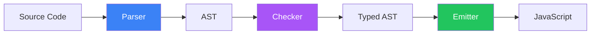

# パイプ演算子をTypeScript<br>に勝手に実装して遊ぶ話

中村崇人

<div class="abs-br m-6 flex gap-2">
  <a href="https://github.com/aTakatoNakamura" target="_blank" alt="GitHub" title="Open in GitHub"
    class="text-xl slidev-icon-btn opacity-50 !border-none !hover:text-white">
    <carbon-logo-github />
  </a>
</div>

<!--
こんにちは！今回はTypeScriptコンパイラにパイプ演算子を実装した話をします。
-->

---
layout: center
---

# 自己紹介

<div class="grid grid-cols-[1fr_2fr] gap-8 items-center">

<div class="text-center">


### 中村崇人

</div>

<div class="text-left">

-  **所属**: [株式会社ACCESS]
-  **TypeScript**: 業務で使ってます
    - サーバー: Hono
    - フロント: React
-  **趣味**: [バイオリン]

</div>

</div>

<!--
簡単に自己紹介です。
株式会社ACCESSという会社でエンジニアをしています。
TSはサーバーでもフロントでも使用しています。
たまにバイオリン弾いてます。
-->

---
---

# パイプ演算子とは？

JavaScript/TypeScriptの提案中の構文

<div class="grid grid-cols-2 gap-8 mt-8">

<div>

### 従来の書き方

```ts
console.log(
  double(
    square(
      add(1, 2)
    )
  )
);
```

ネストが深くて読みづらい...

</div>

<div>

### パイプ演算子

```ts
1
  |> add(%, 2)
  |> square(%)
  |> double(%)
  |> console.log(%);
```

左から右へ、処理の流れが明確！

</div>

</div>

<div v-click class="mt-8 text-sm opacity-75">

💡 Stage 2の提案: https://github.com/tc39/proposal-pipeline-operator

</div>

<!--
それではパイプ演算子について説明します。

パイプ演算子は、関数の結果を次の関数に渡していく構文です。
従来の書き方だと、ネストが深くなって読みづらくなりますが、
パイプ演算子を使うと、左から右へ処理の流れが読めるので、とても読みやすくなります。

TC39でも提案されている仕様ですが、まだStage 2の提案段階で、正式に使えるようになるには時間がかかりそうです。
-->

---
layout: center
class: text-center
---

# TypeScriptの実行の仕組み

<div class="mt-8">

基本的には、TypeScriptは**JavaScriptに変換してから実行**される

</div>

<div class="mt-8 grid grid-cols-3 gap-4 text-sm">

<div class="p-4 bg-blue-500 bg-opacity-10 rounded">

### TypeScript

```ts
const x: number = 5;
```

</div>

<div class="flex items-center justify-center">

→ 変換 →

</div>

<div class="p-4 bg-green-500 bg-opacity-10 rounded">

### JavaScript

```js
const x = 5;
```

</div>

</div>

<!--
それでは、TypeScriptの実行の仕組みについて簡単に説明します。

基本的に、TypeScriptはそのまま実行できるわけではなく、
JavaScriptに変換してから実行されます。

パイプ演算子をTSに勝手に実装するには、変換の部分に手を加えることで実現できます。
-->

---
layout: center
---

# TypeScriptコンパイラの3層構造

<div class="grid grid-cols-3 gap-4 mt-8">

<div v-click class="p-6 bg-blue-500 bg-opacity-10 rounded">

### 1️⃣ Parser

**入力**: ソースコード  
**出力**: AST

トークン分割 → 構文解析

<div class="text-xs mt-4 opacity-75">
scanner.ts, parser.ts
</div>

</div>

<div v-click class="p-6 bg-purple-500 bg-opacity-10 rounded">

### 2️⃣ Checker

**入力**: AST  
**出力**: 型情報付きAST

型推論・型チェック

<div class="text-xs mt-4 opacity-75">
checker.ts
</div>

</div>

<div v-click class="p-6 bg-green-500 bg-opacity-10 rounded">

### 3️⃣ Emitter

**入力**: AST  
**出力**: JavaScript

コード生成

<div class="text-xs mt-4 opacity-75">
emitter.ts
</div>

</div>

</div>

<div class="mt-8 text-center">



</div>

<!--
TypeScriptコンパイラは3層のアーキテクチャで構成されています。

まず、Parserがソースコードをトークンに分割して構文解析し、
ASTという木構造のデータに変換します。

次に、CheckerがASTを受け取って型推論と型チェックを行い、
型情報を付けたASTを出力します。

最後に、EmitterがASTを受け取ってJavaScriptコードを生成します。

パイプ演算子の実装では全ての層を修正する必要がありました。
-->

---
---

# 今回実装したバージョン

シンプルな `|>` 演算子

```ts
function double(x: number): number {
  return x * 2;
}

function square(x: number): number {
  return x * x;
}

// シンプルなパイプ
const result1 = 5 |> double;  // → (double)(5)

// チェーン可能
const result2 = 5 |> square |> double;  // → (double)((square)(5))
```

<div class="mt-6 p-4 bg-orange-500 bg-opacity-10 rounded">

⚠️ 実験的実装：Hack Proposal版ではなく、最もシンプルな形で実装

</div>

<!--
今回は、最もシンプルなパイプ演算子を実装しました。
5 パイプ doubleは、doubleカッコ5というJavaScriptに変換されます。
チェーンも可能で、5 パイプ square パイプ double は、ネストした関数呼び出しに変換されます。
TC39のHack Proposal版ではなく、最もシンプルな形で実装しています。
-->

---
---

# ステップ1: パーサー

新しいトークンとASTノードの追加

````md magic-move {lines: true}
```ts
// types.ts - SyntaxKindに追加
export const enum SyntaxKind {
    // ...
    BarGreaterThanToken,  // |>
    // ...
    PipeExpression,       // パイプ式のAST
}
```

```ts
// scanner.ts - トークン認識
function scan(): SyntaxKind {
    // ...
    case CharacterCodes.bar:
        if (text.charCodeAt(pos + 1) === CharacterCodes.greaterThan) {
            return pos += 2, token = SyntaxKind.BarGreaterThanToken;
        }
    // ...
}
```

```ts
// parser.ts - AST構築
function parseBinaryExpressionOrHigher() {
    // ...
    case SyntaxKind.BarGreaterThanToken:
        return factory.createPipeExpression(
            leftOperand,
            operatorToken,
            rightOperand
        );
}
```
````

<!--
ステップ1はパーサーです。パーサーは3つのファイルを修正する必要があります。

まず、types.tsでSyntaxKindというenumに、新しいトークンとASTノードの種類を追加します。
BarGreaterThanTokenが縦棒と大なり記号のトークンで、PipeExpressionがパイプ式のASTノードです。

次に、scanner.tsでトークンを認識させます。
scan関数の中で、縦棒の文字を見つけたら、次の文字が大なり記号かチェックして、
そうならBarGreaterThanTokenを返します。

最後に、parser.tsでAST構築のロジックを追加します。
parseBinaryExpressionOrHigher関数の中で、BarGreaterThanTokenを見つけたら、
factory.createPipeExpressionを呼び出して、左辺、演算子、右辺の3つを渡してASTノードを作ります。

これでパーサーの実装は完了です。
-->

---
---

# ステップ2: チェッカー

型システムとの統合

```ts {all|3-4|6-7|9-14|all}
function checkPipeExpression(node: PipeExpression): Type {
  // 左辺の型をチェック (例: 5 → number)
  const leftType = checkExpression(node.left);
  
  // 右辺の型をチェック (例: square → (number) => number)
  const rightType = checkExpression(node.right);
  
  // 本来は以下のチェックが必要:
  // - 右辺が関数型か？
  // - 左辺の型を右辺の引数として渡せるか？
  
  // 今回はシンプルに関数の戻り値の型を返す
  return getReturnTypeOfFunction(rightType);
}
```

<!--
ステップ2はチェッカーです。チェッカーは型チェックを担当します。

checkPipeExpressionという関数を新しく作ります。
まず、左辺の型をチェックします。例えば5ならnumber型です。
次に、右辺の型をチェックします。例えばsquare関数なら、number を受け取ってnumberを返す関数型です。

本来なら、右辺が本当に関数型か、左辺の型を引数として渡せるか、といった詳細なチェックが必要ですが、
今回はシンプルに、関数の戻り値の型を返すだけにしています。

型の流れを見ると、5パイプsquareでは、numberがnumberを返す関数に渡されて、結果はnumberになります。
その結果がさらにdoubleに渡されて、最終的な型もnumberになります。

このように、チェッカーは型が正しく流れていくことを保証します。
-->

---
---

# ステップ3: エミッター

再帰的なコード生成

<div class="grid grid-cols-2 gap-6 mt-4">

<div>

```ts
function emitPipeExpression(
  node: PipeExpression
) {
  write("(");
  emit(node.right);
  write(")(");
  
  // 左辺がPipeなら再帰
  if (isPipe(node.left)) {
    emitPipeExpression(
      node.left
    );
  } else {
    emit(node.left);
  }
  
  write(")");
}
```

</div>

<div>

### 変換の流れ

```
5 |> square |> double
```

<div class="mt-4 text-sm">

1. 外側の `|> double` を処理
2. `(double)(...)` を出力
3. 左辺 `5 |> square` を再帰処理
4. `(square)(5)` を出力
5. 結果: `(double)((square)(5))`

</div>

</div>

</div>

<!--
ステップ3はエミッターです。エミッターはJavaScriptコードを生成します。

emitPipeExpression関数を作ります。
この関数は、パイプ式を「関数カッコ引数カッコ」という形に変換します。

まず、開きカッコを書いて、右辺の関数を出力します。
次に、閉じカッコと開きカッコを書きます。
そして、左辺を出力するのですが、ここがポイントです。

左辺がまたPipeExpressionなら、つまりチェーンされたパイプなら、
emitPipeExpression自身を再帰的に呼び出します。
そうでなければ、普通に左辺を出力します。
最後に閉じカッコを書きます。

例えば、5パイプsquareパイプdoubleの場合、
まず外側のdoubleを処理して、カッコdoubleカッコカッコと出力します。
次に、左辺の5パイプsquareを再帰的に処理して、カッコsquareカッコ5カッコカッコと出力します。
これで、カッコdoubleカッコカッコカッコsquareカッコ5カッコカッコカッコという、
正しくネストした関数呼び出しになります。

この再帰処理が、チェーンされたパイプを正しく変換する鍵でした。
-->

---
---

# デモ 🎬

実際に動かしてみよう！

```ts
function double(x: number): number {
    return x * 2;
}

function square(x: number): number {
    return x * x;
}

const result1 = 5 |> double;
console.log("result1:", result1);  // 10

const result2 = 5 |> square |> double;
console.log("result2:", result2);  // 50
```

<div class="mt-6 p-4 bg-gradient-to-r from-blue-500 to-purple-500 bg-opacity-20 rounded">

```bash
$ node built/local/tsc.js test.ts
$ node test.js
result1: 10
result2: 50
```

</div>

<!--
それでは実際に動かしてみます。

test.tsというファイルにコードを書きました。
doubleとsquareという関数を定義して、
5パイプdouble、と、5パイプsquareパイプdoubleという2つのパイプ式を書いています。

これを自分で改造したTypeScriptコンパイラでコンパイルします。
コンパイルは「node built local tsc.js test.ts」です。

そして、生成されたtest.jsをnodeで実行すると、
result1は10、result2は50と出力されます。

5パイプdoubleは5×2で10。
5パイプsquareパイプdoubleは、まず5の2乗で25、その2倍で50。
パイプ演算子が正しく動作しました！
-->

---
layout: center
class: text-center
---

# まとめ

<div class="mt-12 text-left max-w-2xl mx-auto">

<v-clicks>

- TypeScriptにパイプ演算子を実装
- Parser, Checker, Emitterの3ステップで実装
- 再帰処理が鍵だった

</v-clicks>

</div>

<div v-click class="mt-12 p-4 bg-blue-500 bg-opacity-10 rounded max-w-2xl mx-auto">

コンパイラ実装、意外と楽しいです。  
AIと一緒にやればなんとかできます。

</div>

<div class="abs-br m-6 text-sm opacity-50">
  GitHub: microsoft/TypeScript
</div>

<!--
最後にまとめます。

今日は、TypeScriptにパイプ演算子を実装した話をしました。
Parser、Checker、Emitterの3ステップで実装し、
特に、チェーンされたパイプを正しく処理するための再帰処理が鍵でした。

コンパイラ実装は難しそうに思えますが、
やってみると意外と楽しいです。
AIと一緒にやればなんとかなります。
皆さんもぜひ試してみてください！
-->

---
layout: end
---

# ありがとうございました！

